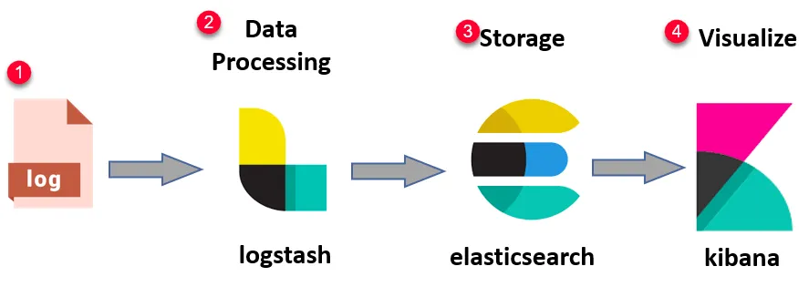

# Rust StashLog

A minimalistic Rust library for [Logstash Event](https://github.com/elastic/logstash/blob/main/logstash-core/src/main/java/org/logstash/Event.java) format logging.


[](https://github.com/MedUnes/stashlog/actions/workflows/publish.yml) [](https://github.com/MedUnes/stashlog/actions/workflows/test.yml)

### Usage

```rust
use medunes::stashlog;
fn main() {
        let logger = stashlog::Logger {
            config: Config {
                version: 1,
                app_name: "my-app".to_string(),
                file_path: "/home/my-app/logs/logstash.log".to_string(),
            },
        };
        logger.info("User Logged in");
        logger.info_extra("User Logged in", &json!({"user_id": user_id}).to_string());
        logger.error_extra("Maximum login attemps reached", &json!({"user_id": user_id}).to_string());
```

### An example of production case scenario

#### 1- Generate with `StashLog`

Your rust application uses the `stashlog` package to output logs to a preconfigured file path: for example here ```/opt/example-app/log-path/logstash.log```

#### 2- Push with ```Filebeat```

* We suppose the app on the server writes logs to ```/opt/example-app/log-path/logstash.log```
* Here is an example [filebeat](https://www.elastic.co/guide/en/beats/filebeat/current/filebeat-overview.html) configuration which keeps pusing the log changes to a [Logstash](https://www.elastic.co/logstash) server supposedly at ```some-server.logstash.com:5044```

```yaml
#/etc/filebeat/filebeat.yml
filebeat.inputs:
- type: log
  enabled: true
  paths:
    - /opt/example-app/log-path/logstash.log
  fields:
    log_type: logstash

output.logstash:
  hosts: ["some-server.logstash.com:5044"]
  transport: udp
```

#### 3- Collect & View with ```ELK```

* [Logstash](https://www.elastic.co/logstash), if correctly configured, will index the incoming traffic to  [Elasticsearch](https://www.elastic.co/elasticsearch)
* You can then use [Kibana](https://www.elastic.co/kibana) to search, filter and visualize your application's logs.



### Credits

* Inspired from [Monolog](https://github.com/Seldaek/monolog/blob/main/src/Monolog/Formatter/LogstashFormatter.php)
